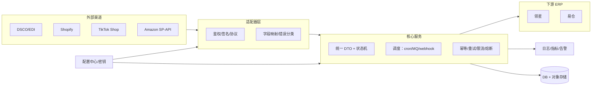

# 服务说明（系统对接型后台服务）

## 概述与目标场景
- 跨系统数据流转服务，核心实体：订单、发货、发票、库存。
- 典型流程：“拉取外部 → 转换 → 落库/分发 → 回传/确认”，通过定时任务与事件触发确保状态对齐。
- 目标：对接多渠道 C 端/B 端（DSCO、Shopify、TikTok Shop、Amazon SP-API 等），数据流转到领星/易仓等 ERP，保持状态一致、可追踪、可补偿。

## 架构概览


## 对接范围与触发模式
- 定时任务（cron/ticker）：周期性拉取/补偿（订单、库存、对账），支持断点续跑与幂等落库。
- 事件驱动：Webhook/MQ/HTTP 手动触发，常用于即时同步或补单；入站需验签/时间戳/nonce 防重放，并支持速率限制。
- 重放/补偿：失败任务留在待处理队列/表中，可人工重试或定时重跑；重试计数、最后错误持久化。

## 适配器层与渠道特点
- 每个外部系统独立 adapter，负责协议、鉴权、数据映射与错误分类。
- 常见协议：HTTP API（OAuth2/API Key/HMAC）、SFTP/FTPS（FSTP）、AS2/EDI、RPA 文件投递。
- 渠道要点：
  - DSCO：典型代发/EDI，订单/ASN/发票文件流，偏批处理与文件拉取。
  - Shopify：REST/GraphQL + Webhook，订单/库存即时同步；需 HMAC 校验、分页与增量处理。
  - TikTok Shop：开放平台 API + Webhook，订单与发货事件驱动；注意签名、限流与分片。
  - Amazon SP-API：Orders/Feeds/Reports，长链路分页、速率限制、重放签名；发货/发票回传走 Feeds/Tasks。

## ERP 侧对接（领星/易仓等）
- 输出统一 DTO（订单/发货/发票/库存），再适配 ERP 接口模型；状态机对齐（如订单：created → synced → shipped → invoiced）。
- ERP 常用 HTTP API：推单、推发货、库存回传、异常单处理；必要时支持批量写入降低调用次数。
- 渠道与 ERP 间的映射、字段差异、税费/物流规则需配置化，并以幂等键或唯一索引保证唯一。

## 数据模型与状态机
- 统一 DTO + 状态流转定义；数据库记录状态、时间戳、幂等键，支持断点续跑和问题追踪。
- 处理表/任务表记录尝试次数与最后错误，支持人工重试与定时重跑。

## 幂等、重试、限流
- 外呼封装超时/重试/限流/熔断，关键路径使用幂等键或唯一索引。
- 支持批处理减少调用次数；出站/入站均记录 trace 便于审计。

## 典型流程（订单）
```mermaid
flowchart TD
  A[拉取外部订单<br/>cron/webhook/file] --> B[幂等解析落库]
  B --> C[映射内部订单 DTO]
  C --> D[推送 ERP(领星/易仓)<br/>或入队分发]
  D --> E[监听/查询 ERP 状态]
  E --> F[组装发货/发票回传渠道]
  F --> G[更新状态<br/>记录尝试+错误]
  G --> H[告警/指标/审计日志]
```

## 监控与告警
- 异常留存、重试计数超阈值告警；metrics：成功/失败/耗时/重试次数/队列堆积。
- 结构化日志包含 trace ID/租户/渠道；关键任务开始/结束日志用于排查。

## 配置与开关
- 按渠道/租户/环境配置凭据、API 地址、节流参数、任务开关（订单/库存/发票同步）。
- 敏感配置不入库/不入日志，密钥集中管理；渠道/ERP 字段映射与税费/物流策略配置化。

## 安全合规
- 出站：鉴权（OAuth2 刷新、签名）、mTLS/IP 白名单；请求/响应脱敏日志。
- 入站：Webhook 验签、防重放（时间戳 + nonce + 签名），速率限制。
- 证书/密钥轮换计划，审计日志记录收发与处理结果。

## 部署与扩展
- 无状态服务（多实例水平扩展）；任务并发需分布式锁或分片。
- 可外挂 MQ 解耦高峰；存储以关系型为主（状态与追踪），对象存储用于大文件。

## 开发流程建议
- 梳理外部 API/文件格式与内部 DTO/状态机。
- 实现 adapter mock 跑 usecase 测试；接入真实沙箱（分渠道验证签名/限流/分页）。
- 补全 cron/MQ/webhook 触发；加监控与告警；灰度上线。
