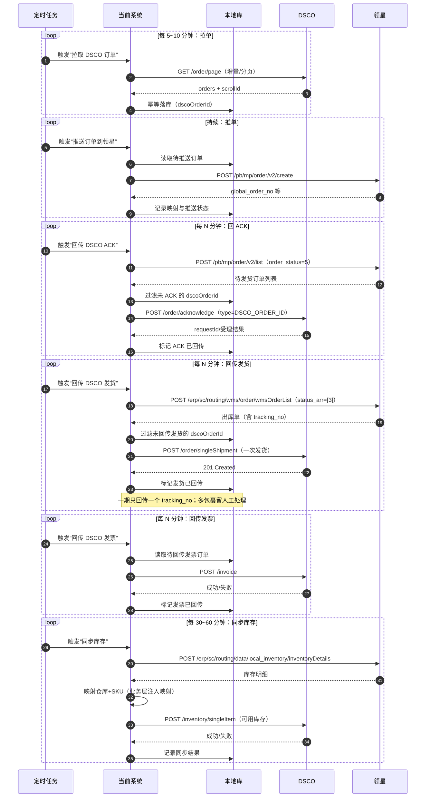

# 第一期业务需求（DSCO ↔ 领星 自动化）

## 1. 背景与目标

本系统作为“跨系统数据流转服务”，第一期只聚焦 **DSCO ↔ 领星** 两个系统之间的订单/发货/发票/库存数据自动化对齐，目标是形成闭环：**DSCO 订单进入领星 → 领星审核后回 ACK → 领星发货后回传发货信息 → 发票回传 → 库存对齐**。

## 2. 业务范围（一期做什么/不做什么）

### 2.1 做什么（In Scope）

1. **订单同步（DSCO → 领星）**
   - 定时从 DSCO 拉取订单（增量+补偿），将订单推送到领星创建为“手工订单/自定义平台订单”。
2. **订单确认 ACK（领星 → DSCO）**
   - 跟踪领星订单状态；当订单满足“可确认（运营审核通过/进入履约阶段）”条件时，向 DSCO 回传 ACK。
3. **发货回传（领星 → DSCO）**
   - 跟踪领星订单/出库单；当订单已发货且尚未回传 DSCO 时，回传物流跟踪号等发货信息给 DSCO。
4. **发票回传（当前系统 → DSCO）**
   - 根据订单信息生成发票数据并回传 DSCO。
5. **库存同步（领星 → DSCO）**
   - 定时从领星拉取指定仓库/范围的库存明细，同步到 DSCO。

### 2.2 不做什么（Out of Scope）

1. **领星 ↔ 运去哪儿（或任何三方仓/物流商）的交互**
   - 包括：渠道匹配、面单生成、发货单下发三方仓、三方仓发货状态回写领星等，均不在一期范围内。
2. **复杂的业务配置平台化**
   - 例如：可视化字段映射、可视化规则引擎、通用工作流编排等，不在一期范围内。

## 3. 术语与系统边界

### 3.1 系统

- **DSCO**：外部订单/发货/发票/库存系统（接口/文档以 DSCO API 为准）。
- **领星（LingXing）**：ERP 中枢（接口/文档以 领星 OpenAPI 为准）。
- **当前系统**：本项目实现的后台服务，负责定时任务、数据转换、幂等与补偿、以及 DSCO/领星两侧的 API 调用。

### 3.2 核心对象（一期关注）

- 订单（Order）
- ACK（订单确认）
- 发货（Shipment）
- 发票（Invoice）
- 库存（Inventory）

## 4. 一期业务主流程（端到端闭环）

> 说明：本章只定义“业务流程与边界”，具体字段映射在后续结合双方 API 文档再落表。

### 4.0 一期整体时序（定时任务驱动）

### 4.1 流程 A：拉取 DSCO 订单（增量 + 补偿）

- 触发：定时任务（例如每 5~10 分钟）。
- 输入：DSCO 订单列表（按时间窗口/分页获取）。
- 输出：进入“待推送领星”的订单队列（业务意义上的队列，可用数据库状态表达）。
- 业务要求：
  - 支持断点续跑（上次拉取窗口/游标可持续推进）。
  - 拉取同一订单多次不会造成重复推送（需要幂等）。

### 4.2 流程 B：推送订单到领星（创建订单）

- 触发：定时任务扫描“待推送领星”的订单。
- 输入：DSCO 订单（本地落库的标准化订单数据）。
- 输出：领星订单创建成功；本地记录 DSCO 订单与领星订单之间的关联信息。
- 业务要求：
  - 推送失败需可重试、可补偿，不影响其他订单处理。
  - 同一 DSCO 订单重复推送不得在领星产生重复订单（需要幂等）。

### 4.3 流程 C：领星审核后回传 DSCO ACK

- 触发：定时任务拉取/查询领星订单状态。
- 输入：领星订单状态变化信息。
- 输出：对 DSCO 发起 ACK（确认订单）。
- 业务要求：
  - ACK 条件需要可配置（一期约定：`order_status=5（待发货）` 即可 ACK）。
  - ACK 只允许回传一次（需要幂等）；失败可重试但不重复产生副作用。

### 4.4 流程 D：跟踪领星发货状态并回传 DSCO 发货信息

- 触发：定时任务拉取领星侧“已发货/可回传”的订单或出库单列表。
- 输入：领星侧发货信息（例如：跟踪号、发货时间、出库单号等）。
- 输出：对 DSCO 回传发货信息（Shipment）。
- 业务要求：
  - 仅处理“已发货但 DSCO 未收到”的记录（需要本地状态或对账判断）。
  - 回传失败可重试/补偿。
  - 一期强约束：一单只回传一次、且只回传一个 `tracking_no`；多包裹场景先由人工处理。
  - 数据源策略（一期约定）：
    - 目的：DSCO 发货回传需要“可定位订单 + 跟踪号”等明细；仅有“订单已发货状态”不足以完成回传。
    - 第一步（候选筛选）：使用领星订单管理列表 `/pb/mp/order/v2/list`，以 `order_status=6（已发货）` 筛出“可能需要回传发货”的订单。
    - 第二步（权威取数）：使用领星销售出库单列表 `/erp/sc/routing/wms/order/wmsOrderList`，以 `status=3（已发货）` 且 `tracking_no` 非空作为“可回传发货”的最终判定与数据来源。
    - 为什么不只用订单列表：订单列表的“已发货”更多是业务状态，未必包含可直接用于 DSCO 回传的 `tracking_no` 等字段；出库单列表天然承载履约/物流明细，更适合作为回传数据源。

### 4.5 流程 E：生成并回传发票到 DSCO

- 触发：定时任务扫描“需要回传发票”的订单。
- 输入：订单信息（以及生成发票所需的业务字段）。
- 输出：DSCO 发票创建成功；本地记录发票回传状态。
- 业务要求：
  - 一期先以“可生成/可回传”为目标，字段口径后续再与 DSCO 发票 API 对齐。

### 4.6 流程 F：库存同步（领星 → DSCO）

- 触发：定时任务（例如每 30~60 分钟或按业务要求）。
- 输入：领星库存明细（按仓库/店铺/SKU 等维度查询）。
- 输出：DSCO 库存更新（单品/批量更新取决于 DSCO API 能力与限流要求）。
- 业务要求：
  - 一期口径：仅同步可用库存。
  - 可配置同步范围（仓库、SKU 范围、是否包含 0 库存等）。
  - 仓库+SKU 代码映射由业务层注入，基础设施不内置映射规则。
  - 重试与补偿：网络/限流等失败可重试，避免全量反复冲击。

## 5. 幂等与补偿（一期约束）

### 5.1 幂等主键（原则）

- 一期以 **`dscoOrderId`** 作为幂等主键，贯穿：推送领星、回 ACK、回传发货、回传发票。

### 5.2 补偿与重试（原则）

- 每个流程都必须可独立重跑，不依赖人工“按顺序”操作。
- 失败需要记录：失败次数、最后错误、最后尝试时间，支持后续定位与人工介入。

## 6. 验收标准（一期）

1. 能稳定从 DSCO 拉取订单并成功推送到领星（重复运行不产生重复订单）。
2. 领星订单满足 ACK 条件后，能够对 DSCO 回 ACK（重复运行不产生重复 ACK 副作用）。
3. 领星订单已发货后，能够将发货信息回传 DSCO（重复运行不产生重复发货回传副作用）。
4. 能生成并回传发票到 DSCO（重复运行不产生重复发票副作用）。
5. 能从领星同步库存到 DSCO（可配置范围，失败可补偿）。
6. 全链路具备可追踪性：至少能按 DSCO 订单号查询到在本系统与领星/DSCO 的同步状态与错误原因。

## 7. 口径确认与待确认事项

### 7.1 已确认（可直接落地为一期约定）

1. **DSCO 订单唯一标识口径：优先使用 `dscoOrderId`（也就是 ACK 接口里的 `type=DSCO_ORDER_ID`）**
   - 依据：DSCO 的 ACK 接口 `/order/acknowledge` 的入参是 `{id,type}`，其中 `type` 支持 `DSCO_ORDER_ID/PO_NUMBER/SUPPLIER_ORDER_NUMBER`，并明确说明 `DSCO_ORDER_ID` 时 `id` 取订单对象的 `dscoOrderId`。
   - 同时：DSCO 的发货回传 `/order/singleShipment` 也支持用 `dscoOrderId/poNumber/supplierOrderNumber` 三选一定位订单。
   - 结论：一期在本系统中持久化的主键应当是 `dscoOrderId`；`orderKey+value` 仅用于 DSCO 的“查询订单对象（GET /order/）”场景，不适合作为全链路幂等主键。
2. **ACK 触发条件（一期约定）：领星订单状态 `order_status=5（待发货）` 即可 ACK**
   - 依据：领星订单管理列表接口 `/pb/mp/order/v2/list` 的 `order_status` 枚举包含 `4 待审核`、`5 待发货`、`6 已发货`。
   - 一期约定：`order_status` 从 `4` 进入 `5` 代表已审核通过且进入履约阶段，此时由当前系统回 DSCO ACK。
3. **发货回传条件（一期约定）：领星出库单 `status=3（已发货）` 且存在 `tracking_no` 后回传 DSCO**
   - 依据：领星“销售出库单列表”接口 `/erp/sc/routing/wms/order/wmsOrderList` 返回字段包含 `status（1物流下单/2发货中/3已发货/4已删除）`、`tracking_no（跟踪号）`、`delivered_at（出库时间）`。
   - 一期约定：以该接口返回作为“已发货可回传”的判定与数据来源；当 `status=3` 且 `tracking_no` 非空时，回传 DSCO 发货信息。
4. **一期发货回传策略（强约束）：一单只回传一次、且只回传一个跟踪号**
   - 说明：可能存在“一单多包裹/分批发货”，但一期仅自动回传一个 `tracking_no`；若发现多个发货/多个跟踪号，先由人工处理。
   - 可扩展要求：系统内部需要保留“可扩展为多包裹回传”的条件（例如能记录多个 tracking_no/出库单号），但一期不自动触发多次回传。
5. **库存同步口径（一期约定）：仅同步可用库存**
   - 说明：库存同步以 DSCO 库存接口可接受的“数量字段”口径为准，一期先按“可用库存=quantity”回传。
   - 仓库+SKU 映射：由业务层注入一个“指定结构”的映射变量完成（例如 map 或结构体），SDK/基础设施不内置映射规则。
6. **发票生成口径（一期约定）：完全按 DSCO 接口必填字段与校验规则生成并回传**
   - 说明：币种/税费/金额/明细等字段的必填与取值范围，以 DSCO 发票接口文档为准。

### 7.2 未确认（需要业务/接口细节落定）

1. **推单到领星时的“平台单号（platform_order_no）取值策略”**
   - 建议：使用 `dscoOrderId` 作为 `platform_order_no`，便于反查与幂等（需结合领星店铺维度确认唯一性约束）。
2. **DSCO 拉单增量策略的字段选择**
   - `/order/page` 支持 `ordersCreatedSince` 或 `ordersUpdatedSince` + `until`；一期需要确定用哪一种作为主策略，以及状态过滤是否仅拉 `created/shipment_pending`。
3. **领星库存“可用库存”字段口径**
   - 说明：领星库存明细返回字段较多，一期需要明确“可用库存”对应的具体字段口径，以便正确回传到 DSCO 的库存数量字段。

## 8. 接口清单（一期涉及的 DSCO 与 领星接口）

> 说明：本章用于“业务边界对齐”，只罗列一期会调用到的接口与用途；字段映射在后续实现阶段结合双方 API 文档逐项落表。

### 8.1 DSCO（一期必用）

- **拉取订单（增量/分页）**
  - `GET /order/page`：按 `ordersCreatedSince` 或 `ordersUpdatedSince` + `until` 增量拉单，支持 `scrollId` 翻页。
  - 备注：可用 `status` 过滤（`created/shipment_pending/shipped/cancelled`）。
- **订单 ACK**
  - `POST /order/acknowledge`：按 `{id,type}` 回传订单确认，一期使用 `type=DSCO_ORDER_ID`，`id=dscoOrderId`。
  - （可选）`GET /order/log`：按 `requestId` 查询异步 ACK 的处理结果（用于审计与排错）。
- **发货回传**
  - `POST /order/singleShipment`：回传一次发货信息，一期使用 `dscoOrderId` 定位订单，且只回传一个 `tracking_no`。
- **发票**
  - `POST /invoice`：创建/回传发票。
  - `GET /invoice`：按 `key/value` 查询发票（用于幂等与对账）。
- **库存**
  - `GET /inventory`：按 `itemKey/value` 查询库存（用于对账/排错）。
  - `POST /inventory/singleItem`：更新单个 SKU 在单个/多个仓库的库存数量（一期仅同步“可用库存”）。

### 8.2 领星（一期必用）

- **创建订单（DSCO → 领星）**
  - `POST /pb/mp/order/v2/create`：创建多平台店铺“手工订单/自定义平台订单”。
- **订单状态跟踪（用于 ACK 判定）**
  - `POST /pb/mp/order/v2/list`：查询订单管理列表，一期用 `order_status=5（待发货）` 判定“可 ACK”。
- **发货状态跟踪（用于回传 DSCO 发货）**
  - 候选筛选：`POST /pb/mp/order/v2/list`：以 `order_status=6（已发货）` 筛选候选订单（减少出库单查询范围）。
  - 权威取数：`POST /erp/sc/routing/wms/order/wmsOrderList`：查询销售出库单列表，一期用 `status=3（已发货）` 且 `tracking_no` 非空判定“可回传发货”，并以此接口字段作为 DSCO 发货回传数据来源。
- **库存查询（用于同步 DSCO 库存）**
  - `POST /erp/sc/routing/data/local_inventory/inventoryDetails`：查询仓库库存明细，一期取“可用库存”口径对齐 DSCO。

### 8.3 鉴权（一期必用）

- **DSCO**
  - `POST /oauth2/token`：获取 `access_token`（`client_credentials`）。
- **领星**
  - `POST /api/auth-server/oauth/access-token`：获取 `access_token` 与 `refresh_token`（`multipart/form-data`）。
  - `POST /api/auth-server/oauth/refresh`：续约/刷新 `access_token`（`multipart/form-data`）。
