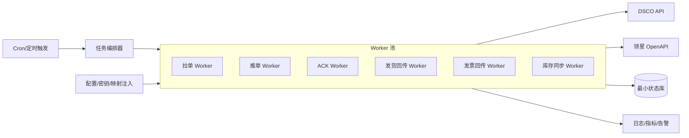
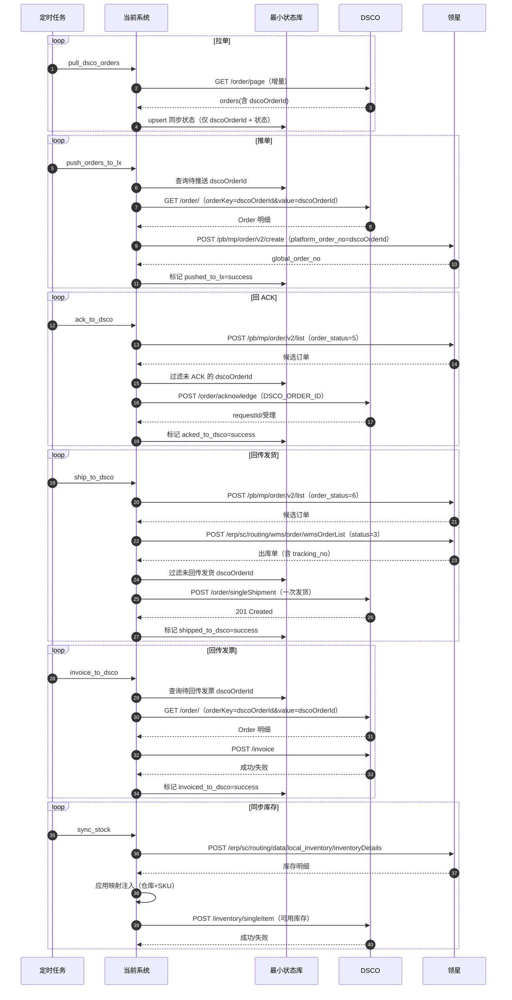

# 第一期系统设计（DSCO-领星自动化）

## 1. 设计目标与约束

### 1.1 目标

- 系统定位：**数据通道 + 自动化编排**，尽量不承载业务主数据。
- 数据最小化：订单/发货/发票/库存等**业务明细以 DSCO 与领星为准**，系统仅存“处理状态与幂等信息”。
- 可运维：可追踪、可重试、可补偿、可回滚到人工处理。

### 1.2 非目标（一期不做）

- 不做通用字段映射平台/规则引擎/工作流编排器。
- 不做复杂的“同步中台”式全量数据仓库。
- 不做领星 ↔ 三方仓/物流的任何对接。

## 2. 核心设计原则（最小存储）

### 2.1 “不存业务明细”的落地方式

- **不落库订单原文**：需要推单/开票时，按 `dscoOrderId` **回源 DSCO 拉取订单对象**，直接映射成领星/DSCO 的目标请求并调用。
- **不在系统内形成二次 DTO**：系统内部只存在“调用入参的临时结构”（内存中），不持久化。
- **只存状态与幂等**：系统只落库以下信息：
  - 订单级唯一标识：`dscoOrderId`（主键）
  - 领星侧关键回执：例如 `global_order_no`（若创建接口返回）
  - 各流程的处理状态（是否已推单/已 ACK/已回传发货/已回传发票）
  - 重试信息（次数、最后错误、最后尝试时间）
  - 拉单游标/水位（`ordersCreatedSince`/`ordersUpdatedSince` + `until`，或 `scrollId` 仅短期使用）

### 2.2 为什么仍需要“少量存储”

DSCO/领星接口不保证你“无状态重跑必然不重复副作用”，一期又要求“幂等 + 补偿”，因此系统必须至少存：

- **幂等键与结果**（例如某 `dscoOrderId` 是否已 ACK）
- **任务水位/断点**（避免每次全量扫）
- **失败与告警上下文**（否则无法定位与人工介入）

## 3. 总体架构（一期推荐）

### 3.1 组件划分




### 3.2 运行模式

- 全部流程由**定时任务驱动**（一期不引入 MQ/Webhook 也能跑通）。
- 每个流程独立 Worker：
  - 失败不阻塞其他流程
  - 可单独重跑
  - 可按租户/店铺/仓库分片（需要时再加）

## 4. 最小数据模型（建议）

> 只存“状态与幂等”，不存订单明细。

### 4.1 同步状态表（示例字段）

- `dsco_order_id`：主键，`dscoOrderId`
- `lingxing_global_order_no`：可空（推单成功后回写）
- `pushed_to_lx_at` / `pushed_to_lx_status`
- `acked_to_dsco_at` / `acked_to_dsco_status`
- `shipped_to_dsco_at` / `shipped_to_dsco_status`
- `invoiced_to_dsco_at` / `invoiced_to_dsco_status`
- `retry_count` / `last_error` / `last_attempt_at`
- `created_at` / `updated_at`

### 4.2 拉单水位表

- `job_name`：例如 `pull_dsco_orders`
- `since`：上次成功拉取的起始时间（或更新水位）
- `until`：上次拉取的截止时间（用于 DSCO “必须在过去 5 秒”的限制）
- `updated_at`

## 5. 核心流程设计（一期）

### 5.0 一期整体时序（最小存储 + 回源取数）



### 5.1 DSCO → 领星：推单

- 拉单只获取 `dscoOrderId`（以及必要的状态/时间字段用于筛选）。
- 推单时按 `dscoOrderId` 回源 DSCO 获取订单对象（`GET /order/`，`orderKey=dscoOrderId&value=dscoOrderId`），映射为领星创建订单请求，调用领星 `/pb/mp/order/v2/create`。
- 幂等：
  - 系统侧：`dscoOrderId` 在状态表中若已 `pushed_to_lx_status=success`，则跳过。
  - 领星侧：建议将 `platform_order_no` 设置为 `dscoOrderId`，用领星“同一店铺不支持重复平台单号”的约束做第二道幂等（需要业务确认店铺维度）。

### 5.2 领星 → DSCO：ACK

- 候选来源：领星 `/pb/mp/order/v2/list`，筛选 `order_status=5（待发货）`。
- 回传：对 DSCO `/order/acknowledge` 发送 `type=DSCO_ORDER_ID`，`id=dscoOrderId`。
- 幂等：状态表 `acked_to_dsco_status=success` 则跳过。

### 5.3 领星 → DSCO：发货回传（一期只回传一个跟踪号）

- 候选筛选：领星 `/pb/mp/order/v2/list`，`order_status=6（已发货）`。
- 权威取数：领星 `/erp/sc/routing/wms/order/wmsOrderList`，筛选 `status=3（已发货）` 且 `tracking_no` 非空。
- 回传：DSCO `/order/singleShipment`（一次发货）。
- 一期强约束：
  - 每个 `dscoOrderId` **只回传一次**、且只回传一个 `tracking_no`。
  - 多包裹/多跟踪号：系统记录为“需人工处理”，不自动多次回传。

### 5.4 当前系统 → DSCO：发票回传

- 按 `dscoOrderId` 回源 DSCO 拉取订单对象（及必要补充信息），生成 DSCO `/invoice` 请求并回传。
- 幂等：以本地 `invoiced_to_dsco_status` 控制；必要时可辅以 DSCO `GET /invoice` 查询做对账。

### 5.5 领星 → DSCO：库存同步（可用库存）

- 数据源：领星 `/erp/sc/routing/data/local_inventory/inventoryDetails`。
- 一期口径：仅同步“可用库存”到 DSCO（具体字段口径待最终确认）。
- 映射：
  - 仓库映射、SKU 映射不落库，由业务层注入（例如 map 或结构体）。
- 回传：DSCO `POST /inventory/singleItem`（优先单品更新，简单直白；若后续要性能再改批量）。

## 6. 字段取值与接口映射（一期）

> 原则：系统不持久化业务明细；以下“字段取值”均指**运行时从 DSCO/领星回源取数**后，临时组装请求。
>
> 若取不到必填字段，直接将该单标记为失败/人工处理，不做“猜测填充”。

### 6.1 推单到领星（DSCO Order → 领星创建订单）

- DSCO 取数：
  - `GET /order/`：`orderKey=dscoOrderId`，`value=<dscoOrderId>`
  - 关键字段来源（DSCO Order schema）：`poNumber`、`lineItems[].sku`、`lineItems[].quantity`、`lineItems[].consumerPrice/retailPrice`、`shipping.*`、`currencyCode`
- 领星接口：
  - `POST /pb/mp/order/v2/create`

#### 6.1.1 一期必填字段映射（最小可跑通）

| 领星字段 | 取值来源 | 规则/备注 |
|---|---|---|
| `platform_code` | 配置 | 一期固定为“自定义平台”或业务指定平台；不从 DSCO 推断 |
| `store_id` | 配置 | 领星店铺唯一标识 |
| `orders[].platform_order_no` | `dscoOrderId` | 一期强约束：用 `dscoOrderId` 做平台单号，便于幂等与回查 |
| `orders[].receiver_country_code` | `order.shipping.country` | 需为国家二字简码；若 DSCO 返回不符合则转人工 |
| `orders[].receiver_name` | `order.shipping.name` | 若为空则尝试拼接 `firstName+lastName`（DSCO 标注 deprecated，但仍可能出现） |
| `orders[].city` | `order.shipping.city` | DSCO shipping.required |
| `orders[].address_line1` | `order.shipping.address[0]` 或 `address1` | 优先取 `address[]` 第一行；否则取 `address1`；若仍为空则转人工 |
| `orders[].items[].sku` | `order.lineItems[].sku` | DSCO 行项目要求提供 sku/dscoItemId 等标识；一期优先 sku |
| `orders[].items[].quantity` | `order.lineItems[].quantity` | 直接映射 |
| `orders[].items[].unit_price` | `order.lineItems[].consumerPrice` | 若为空则用 `retailPrice`；若仍为空则转人工（领星该字段必填） |
| `orders[].amount_currency` | `order.currencyCode` | 若为空，允许不传（领星默认店铺币种）；但建议能取到就传 |

#### 6.1.2 一期暂不映射/后置字段（不影响跑通）

- `wid`、`logistics_type_id`：由后续“仓库/物流规则”配置确定，一期可不传或按业务默认值（若领星接口因缺失报错，再补齐）。
- 地址二三行、邮编、电话：DSCO 可取到则可填充，取不到不强行填充。

### 6.2 回 ACK（领星订单状态 → DSCO acknowledge）

- 候选筛选：领星 `POST /pb/mp/order/v2/list`，`order_status=5（待发货）`
- DSCO 回传：`POST /order/acknowledge`

| DSCO 字段 | 取值来源 | 规则/备注 |
|---|---|---|
| `type` | 常量 | `DSCO_ORDER_ID` |
| `id` | 本地状态库 | `dscoOrderId` |

### 6.3 回传发货（领星出库单 → DSCO singleShipment）

- 候选筛选：领星 `POST /pb/mp/order/v2/list`，`order_status=6（已发货）`
- 权威取数：领星 `POST /erp/sc/routing/wms/order/wmsOrderList`，`status_arr=[3]`
- DSCO 回传：`POST /order/singleShipment`

#### 6.3.1 一期发货回传规则

- 一期只回传一个 `tracking_no`：
  - 若同一 `dscoOrderId` 关联多个出库单或多个 `tracking_no`，写入 `manual_task`（`task_type=multi_shipment`），并将 `shipped_to_dsco_status=3（人工）`。

#### 6.3.2 发货字段映射（最小）

| DSCO Shipment 字段 | 取值来源 | 规则/备注 |
|---|---|---|
| `dscoOrderId` | 本地状态库 | 顶层用于定位订单 |
| `shipments[0].trackingNumber` | `wmsOrderList.data[].tracking_no` | 必填；为空不回传 |
| `shipments[0].shipDate` | `wmsOrderList.data[].delivered_at` | DSCO 期望 ISO8601；若领星为字符串时间，需转换；无法转换则可不传但建议补齐 |
| `shipments[0].lineItems[].sku` | `wmsOrderList.data[].product_info[].sku` | DSCO 需要 lineItems；一期用 sku 标识 |
| `shipments[0].lineItems[].quantity` | `wmsOrderList.data[].product_info[].count` | 必填 |

### 6.4 回传发票（DSCO Order → DSCO Invoice）

- DSCO 取数：`GET /order/`（按 `dscoOrderId`）
- DSCO 回传：`POST /invoice`

#### 6.4.1 发票字段映射（按 DSCO 必填字段最小集）

| DSCO Invoice 字段 | 取值来源 | 规则/备注 |
|---|---|---|
| `invoiceId` | 规则生成 | 一期建议：`INV-<dscoOrderId>`（保证唯一） |
| `dscoOrderId` | 本地状态库 | 用于关联订单 |
| `currencyCode` | `order.currencyCode` | 若为空可不传（但建议传） |
| `invoiceDate` | 当前时间 | ISO8601 |
| `lineItems[]` | `order.lineItems[]` | DSCO `InvoiceLineItem` 要求 `quantity` 与 `unitPrice` |
| `lineItems[].sku` | `order.lineItems[].sku` | 一期使用 sku 标识 |
| `lineItems[].quantity` | `order.lineItems[].quantity` | 必填 |
| `lineItems[].unitPrice` | `order.lineItems[].consumerPrice` | 若为空则用 `retailPrice`；若仍为空则转人工 |
| `totalAmount` | 计算 | `sum(quantity * unitPrice)`（一期先按此口径；若后续需运费/税费再扩展） |

### 6.5 库存同步（领星库存 → DSCO inventory/singleItem）

- 领星取数：`POST /erp/sc/routing/data/local_inventory/inventoryDetails`
- DSCO 回传：`POST /inventory/singleItem`

#### 6.5.1 库存字段映射（一期口径：可用库存）

| DSCO Inventory 字段 | 取值来源 | 规则/备注 |
|---|---|---|
| `sku` | `inventoryDetails.data[].sku` | 先应用 SKU 映射注入（若需要） |
| `warehouses[].code` | 映射注入 | `lingxing_wid -> dsco_warehouse_code` |
| `warehouses[].quantity` | `inventoryDetails.data[].product_valid_num` | 可用库存（领星文档字段：`product_valid_num`） |

## 6. 可靠性设计（幂等、重试、补偿）

### 6.1 幂等策略（一期）

- 主幂等键：`dscoOrderId`。
- 幂等粒度：
  - 推单：按 `dscoOrderId` 幂等
  - ACK：按 `dscoOrderId` 幂等
  - 发货回传：按 `dscoOrderId` 幂等（一期强约束“一次发货”）
  - 发票回传：按 `dscoOrderId` 幂等（若未来拆票需调整粒度）

### 6.2 重试策略

- 对外调用失败：按错误类型区分重试（超时/5xx/限流 -> 可重试；4xx 参数错误 -> 不自动重试，转人工）。
- 重试采用指数退避，且写入 `last_error/last_attempt_at/retry_count`。
- 超过阈值进入“死信/人工处理”状态。

### 6.3 补偿策略

- 所有 Worker 都可以“从状态表重扫”：
  - 只要状态不是 `success`，就可继续补偿。
- 回源 DSCO/领星取数时，务必按时间窗口限制与分页限制，避免每次全量扫描。

## 7. 配置与注入

### 7.1 必要配置

- DSCO：`token`（静态 bearer token，直接走请求头鉴权）、baseURL、账号范围参数（如 dscoAccountId 等，按接口需要）
- 领星：`appId/appSecret/access_token/refresh_token`、baseURL、店铺/平台参数（用于创建订单时）
- 任务开关与频率：拉单/推单/ACK/发货/发票/库存各自可开关

### 7.2 映射注入（一期只做“注入”，不做平台化）

- 仓库代码映射：`lingxingWarehouseCode -> dscoWarehouseCode`
- SKU 映射：`lingxingSKU -> dscoSKU`（若两边一致可为空映射）

## 8. 可观测性与审计

- 日志：按 `dscoOrderId` 打通全链路关键日志，记录外呼的 `request_id`（若有）。
- 指标：每个流程成功/失败/重试次数、积压数量、耗时分位。
- 告警：连续失败、积压超阈值、token 过期/鉴权失败、映射缺失等。

## 8.1 可视化运维后台（Admin UI，MVP）

> 目的：降低长期运维压力，避免反复手工调接口/查库；用网页把“任务/水位/人工队列/订单状态”直观呈现出来。

### 8.1.1 定位与边界

- Admin UI 只服务运维与排障，不承载业务主流程。
- Admin UI 不直接暴露给公网；一期默认部署在内网或通过堡垒机访问。
- Admin UI 的数据来源全部来自本系统数据库（`sync_order_state/job_watermark/manual_task`）与本系统现有管理 API。

### 8.1.2 技术选型（一期）

- Web 框架：Gin
- 页面模板：Go `html/template`（Gin template）
- 前端：轻量原生 JS + 少量 CSS（简洁风格，参考苹果信息层级与留白）
- API：同一进程内提供 JSON API（供页面 Ajax 调用），保持与“脚本/CI/人工 curl”一致口径
- 代码位置：`admin/adminweb/`（与业务代码分离）

### 8.1.3 安全策略（一期最小）

> 一期只做“密码访问”，不做账号体系与次数限制。

- 配置项：`IPASS_ADMIN_PASSWORD`
- 访问策略：
  - 未认证访问 `/admin/ui/*` 自动跳转到登录页
  - 登录页输入密码校验通过后，写入 HttpOnly 的 session cookie（浏览器关闭即失效）
  - session cookie 使用 HMAC 签名（secret 派生自 `IPASS_ADMIN_PASSWORD`），避免明文与篡改
  - 脚本/命令行访问 JSON API：请求头携带 `X-Admin-Password: <IPASS_ADMIN_PASSWORD>`

### 8.1.4 页面与能力（MVP）

MVP 页面清单（建议路由）：

- 登录页：`GET /admin/ui/login`、`POST /admin/ui/login`
- 总览页：`GET /admin/ui/`
  - 展示：各 job 水位摘要、失败/人工/处理中数量、最近更新时间
- 订单状态查询：`GET /admin/ui/order`
  - 输入 `dscoOrderId`，展示 `sync_order_state` 的闭环状态与 last_error/retry_count
- 订单列表：`GET /admin/ui/orders`
  - 支持按 push/ack/ship/invoice 状态筛选、分页
- 人工任务：`GET /admin/ui/manual_tasks`
  - 支持按 status 分页查看（一期只读）
- 水位管理：`GET /admin/ui/watermarks`
  - 可查看/编辑各 job watermark（JSON 文本形式，提交前做 JSON 校验）
- 手动触发：`GET /admin/ui/jobs`
  - 提供按钮触发一次 job（等价于 `/admin/run?job=...`）

### 8.1.5 API 口径（给 UI 与脚本共用）

建议将 JSON API 统一纳入 `/admin/api/*`（或保持现有 `/admin/*`，二选一即可）：

- `GET /healthz`
- `POST /admin/run?job=...`
- `GET /admin/watermark/get?job=...`
- `POST /admin/watermark/set?job=...`
- `GET /admin/manual_tasks?status=0&limit=50&offset=0`
- `GET /admin/order_state/get?dsco_order_id=...`
- `GET /admin/order_states?push_status=&ack_status=&ship_status=&invoice_status=&limit=&offset=`

> 原则：UI 只“消费”这些 API，不再发明另一套口径，避免维护两份逻辑。

## 9. 安全与密钥

- DSCO bearer token、领星 access_token/refresh_token 只放密钥配置，不写日志。
- 对外请求与响应日志脱敏（token、地址电话等敏感字段不落日志或打码）。
- Admin UI 密码只用于访问控制，不写入日志，不回显。

## 10. 数据库选型与建表（一期）

### 10.1 数据库选型

一期推荐使用 **MySQL 8.x（InnoDB，utf8mb4）**：

- 成熟稳定、运维成本低；适合“少量状态数据 + 定时任务轮询”模式。
- 行级锁与唯一约束足以支撑幂等与并发 Worker（多实例）场景。
- 不需要引入更重的组件（例如 MQ）也能跑通一期闭环。

### 10.2 建表 SQL

#### 10.2.1 订单同步状态表

```sql
CREATE TABLE IF NOT EXISTS sync_order_state (
  id BIGINT UNSIGNED NOT NULL AUTO_INCREMENT,
  dsco_order_id VARCHAR(64) NOT NULL COMMENT 'DSCO dscoOrderId（幂等主键）',
  lingxing_global_order_no VARCHAR(64) NULL COMMENT '领星系统单号（global_order_no），创建成功后回写',

  pushed_to_lx_status TINYINT NOT NULL DEFAULT 0 COMMENT '推单到领星状态：0未处理 1成功 2失败 3人工',
  pushed_to_lx_at DATETIME(3) NULL,

  acked_to_dsco_status TINYINT NOT NULL DEFAULT 0 COMMENT '回ACK到DSCO：0未处理 1成功 2失败 3人工',
  acked_to_dsco_at DATETIME(3) NULL,

  shipped_to_dsco_status TINYINT NOT NULL DEFAULT 0 COMMENT '回传发货到DSCO：0未处理 1成功 2失败 3人工',
  shipped_to_dsco_at DATETIME(3) NULL,
  shipped_tracking_no VARCHAR(64) NULL COMMENT '已回传的跟踪号（一期只回传一个）',

  invoiced_to_dsco_status TINYINT NOT NULL DEFAULT 0 COMMENT '回传发票到DSCO：0未处理 1成功 2失败 3人工',
  invoiced_to_dsco_at DATETIME(3) NULL,
  dsco_invoice_id VARCHAR(64) NULL COMMENT '已回传的发票号（invoiceId）',

  retry_count INT NOT NULL DEFAULT 0,
  last_error TEXT NULL,
  last_attempt_at DATETIME(3) NULL,

  created_at DATETIME(3) NOT NULL DEFAULT CURRENT_TIMESTAMP(3),
  updated_at DATETIME(3) NOT NULL DEFAULT CURRENT_TIMESTAMP(3) ON UPDATE CURRENT_TIMESTAMP(3),

  PRIMARY KEY (id),
  UNIQUE KEY uk_dsco_order_id (dsco_order_id),
  KEY idx_push_status (pushed_to_lx_status, updated_at),
  KEY idx_ack_status (acked_to_dsco_status, updated_at),
  KEY idx_ship_status (shipped_to_dsco_status, updated_at),
  KEY idx_invoice_status (invoiced_to_dsco_status, updated_at)
) ENGINE=InnoDB DEFAULT CHARSET=utf8mb4 COLLATE=utf8mb4_0900_ai_ci;
```

#### 10.2.2 任务水位表（增量/断点）

```sql
CREATE TABLE IF NOT EXISTS job_watermark (
  job_name VARCHAR(64) NOT NULL COMMENT '任务名，例如 pull_dsco_orders/sync_stock',
  watermark JSON NOT NULL COMMENT '任务水位（按任务自定义结构）',
  updated_at DATETIME(3) NOT NULL DEFAULT CURRENT_TIMESTAMP(3) ON UPDATE CURRENT_TIMESTAMP(3),
  PRIMARY KEY (job_name)
) ENGINE=InnoDB DEFAULT CHARSET=utf8mb4 COLLATE=utf8mb4_0900_ai_ci;
```

#### 10.2.3 人工处理队列表（可选但推荐）

```sql
CREATE TABLE IF NOT EXISTS manual_task (
  id BIGINT UNSIGNED NOT NULL AUTO_INCREMENT,
  task_type VARCHAR(32) NOT NULL COMMENT '类型：multi_shipment/missing_mapping/bad_payload 等',
  dsco_order_id VARCHAR(64) NULL,
  payload JSON NULL COMMENT '用于排查/补处理的上下文（脱敏后）',
  status TINYINT NOT NULL DEFAULT 0 COMMENT '0待处理 1处理中 2已完成 3已忽略',
  created_at DATETIME(3) NOT NULL DEFAULT CURRENT_TIMESTAMP(3),
  updated_at DATETIME(3) NOT NULL DEFAULT CURRENT_TIMESTAMP(3) ON UPDATE CURRENT_TIMESTAMP(3),
  PRIMARY KEY (id),
  KEY idx_task_status (task_type, status, updated_at),
  KEY idx_task_order (dsco_order_id, updated_at)
) ENGINE=InnoDB DEFAULT CHARSET=utf8mb4 COLLATE=utf8mb4_0900_ai_ci;
```
